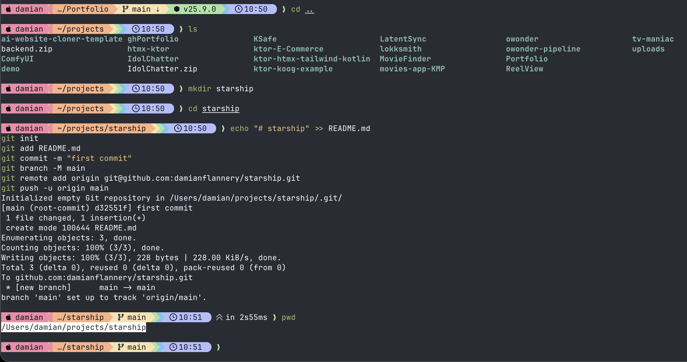
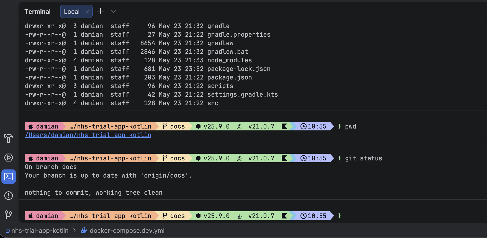

# What is Starship?

I recently came across a post from the developer of Powerlevel10k stating that the project is now on [life support](https://github.com/romkatv/powerlevel10k/issues/2690) so decided to investigate a long term alternative.

[Starship](https://starship.rs) is a minimal, blazing-fast, and infinitely customizable prompt for any shell. It’s designed to be universal, working across different shells and operating systems, providing context-aware information without any lag.

I also took the opportunity to investigate other terminals and settled on [Ghostty](https://ghostty.org/). It's a fast, feature-rich, and cross-platform terminal emulator that uses platform-native UI and GPU acceleration.

## Screenshots

### Ghostty (Main Terminal)


### IntelliJ / Android Studio Terminal


## Setup

### 1. Install Starship
```bash
brew install starship
```

### 2. Install a Nerd Font (Recommended)
```bash
brew install --cask font-jetbrains-mono-nerd-font
# or
brew install --cask font-meslo-lg-nerd-font
```

### 3. Copy Config Files
```bash
mkdir -p ~/.config

cp starship-ghostty.toml ~/.config/starship-ghostty.toml
cp starship-intellij.toml ~/.config/starship-intellij.toml
```

### 4. Update ~/.zshrc
Add this at the bottom of your `~/.zshrc`:

```zsh
# Starship - Different config per terminal
if [[ "$TERM_PROGRAM" == "ghostty" ]]; then
    export STARSHIP_CONFIG=~/.config/starship-ghostty.toml
else
    # IntelliJ, Android Studio, VS Code, etc.
    export STARSHIP_CONFIG=~/.config/starship-intellij.toml
fi

eval "$(starship init zsh)"
```

### 5. Reload
```bash
source ~/.zshrc
```

Done! You now have a clean, maintainable setup with different configs for Ghostty vs JetBrains IDEs (and other terminals).

## Why Two Configs?

- **starship-ghostty.toml**: Uses the rounded powerline character `` for a more modern look in Ghostty.
- **starship-intellij.toml**: Uses the standard powerline character `` for better compatibility in JetBrains IDE terminals (IntelliJ, Android Studio, etc.), which sometimes have rendering issues with certain Unicode glyphs.

Both configs share the same Catppuccin Mocha color palette and feature set.
